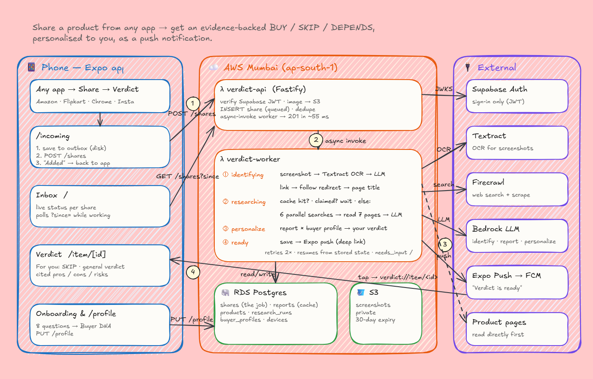

<div align="center">
  
  <h1>Verdict</h1>
  <p><strong>Should you buy it? Share it, and get the answer in seconds.</strong></p>
  <p>Share any product from any app. Verdict reads what real owners and reviewers say, and sends back an evidence-backed <b>BUY / SKIP / DEPENDS</b>, personalised to how <i>you</i> buy.</p>
  <br/>
  <p>
    
    
  </p>
  <p>
    <a href="https://github.com/herin7/Verdict/actions/workflows/verify.yml"></a>
    <a href="https://github.com/herin7/Verdict/issues"></a>
    <a href="https://github.com/herin7/Verdict/stargazers"></a>
  </p>
</div>

---

You're about to buy something. The listing says 4.5 stars, the ads say it's the best, and the
real story is buried across Reddit threads, YouTube reviews and forum complaints you don't have
time to read.

**Verdict** does that reading for you. Tap **Share → Verdict** in Amazon, Flipkart, Chrome,
Instagram, or any other app. You're dropped straight back where you were, and a push notification
arrives when your verdict is ready: what owners love, what breaks, how often, and whether it's
right for *you*.

## ✨ Key Features

* **📤 Share from anywhere**: links, screenshots or plain text, from any app's share sheet. A tiny
  "Added to Verdict" confirmation, then you're back in the app you came from.
* **⚖️ BUY / SKIP / DEPENDS, never a score**: a clear call, with who it's for and who should skip it.
* **🔎 Evidence, not vibes**: pros, cons, recurring issues (with how often they come up), risks
  (with severity), key specs, alternatives and buying advice. Every claim is cited to the pages
  actually read.
* **🧬 Personal verdicts**: eight quick onboarding questions build your *Buyer DNA*. The same
  product can be a BUY for one person and a SKIP for another, and deal-breakers you care about
  always count.
* **🔔 Background processing + push**: research runs in the cloud even if you close the app. Tap the
  notification to jump straight to the verdict.
* **📸 Screenshot understanding**: OCR reads the product off any screenshot.
* **⚡ Fast and frugal**: shares are acknowledged in ~55 ms, links are identified in 1–3 s, and a
  product researched once is instant for everyone after.
* **🛡️ Never loses a share**: shares are saved on the device first and retried until the server has
  them. Duplicates are detected at three levels.

## 🛠️ Tech Stack


## 🏛️ How It Works: Architecture

<div align="center">
  
  <p><em><a href="https://excalidraw.com/#json=Is4Curxoh7SsU_gmihQBP,gxaqJrRrqrHy5Hvcbbs_NQ">Open the editable diagram on Excalidraw</a></em></p>
</div>

Everything runs in one AWS region (Mumbai), so the database is a ~5 ms hop, not a cross-region one.

1. **Share (phone)**: the share sheet opens `/incoming`, which writes the share to an on-device
   outbox, sends `POST /shares`, shows the confirmation and returns you to the previous app.
2. **API (`verdict-api` Lambda)**: verifies your Supabase token, stores screenshots in S3, inserts
   the share into Postgres as `queued` (deduplicated), and invokes the worker asynchronously.
   It responds in ~55 ms.
3. **Worker (`verdict-worker` Lambda)**, a resumable state machine with automatic retries:
   * **Identifying**: screenshot → Textract OCR → LLM. Link → follow the redirect → read the
     product page. Text → LLM. If unsure, it asks you instead of guessing.
   * **Researching**: reuse a cached report, or wait for someone already researching the same
     product. Otherwise it runs 6 parallel searches (Reddit, retail reviews, YouTube, forums,
     experts, specs), reads the top 7 pages, and writes a cited report.
   * **Personalizing**: the report is weighed against your Buyer DNA. Strong conflicts with your
     deal-breakers cap the verdict.
   * **Ready**: saved, then an Expo push notification deep-links to the verdict.
4. **Inbox (phone)**: lists every share with its live status. While something is working, the app
   polls only for changes.

**Deliberately simple:** no queues, no Redis, no microservices. The share row *is* the job,
Lambda's async invoke provides the retries, and Postgres doubles as the cache.

## 📱 The App

| Screen | What it does |
|---|---|
| **Onboarding** | Welcome → 8 one-tap questions → your Buyer DNA |
| **Inbox** | Everything you've shared, with live status and verdicts |
| **Verdict** | "For you" verdict, the general verdict, cited pros/cons/issues/risks, alternatives |
| **Share confirmation** | "Added to Verdict · Investigating…", then back to your app |
| **Profile** | Your Buyer DNA, priorities, deal-breakers; retake any time |

Minimal, iPhone-like UI: big type, lots of whitespace, springy motion and haptics, light and dark
themes, all from a single design-token file (`app/src/theme.ts`). No custom native modules.

## 🚀 Shipping

* **Every push to `main`** runs the EAS Deploy workflow. It fingerprints the native code:
  * **unchanged** → an **over-the-air update** is published in seconds;
  * **changed** → one installable arm64 APK is built.
* **CI** (`.github/workflows/verify.yml`) runs typecheck, tests and a dependency audit on every push.
* **Backend** is bundled with esbuild into two Lambda packages and deployed with a private,
  idempotent script. Database migrations use Drizzle (`npm run db:migrate`).

## 💻 Get It Running Locally

### Prerequisites
* [Node.js](https://nodejs.org/) 22+ and npm
* A Postgres database
* A [Supabase](https://supabase.com/) project (auth only)
* A [Firecrawl](https://firecrawl.dev/) key and access to an LLM on Amazon Bedrock (or Anthropic)
* AWS credentials for S3 + Textract (only needed for screenshot shares)
* Android Studio / an Android device for the app

<details>
<summary>Click to view step-by-step setup</summary>

1. **Clone the repository**
   ```sh
   git clone https://github.com/herin7/Verdict.git
   cd Verdict
   ```

2. **Start the server** (port 8787)
   ```sh
   cd server
   cp .env.example .env   # fill in DATABASE_URL, Supabase, Firecrawl and LLM settings
   npm install
   npm run db:migrate
   npm run dev
   ```
   Without `WORKER_FUNCTION_NAME`, shares are processed in-process, so no Lambda is needed locally.

3. **Run the app**
   ```sh
   cd ../app
   cp .env.example .env   # EXPO_PUBLIC_API_URL=http://<your-computer's-LAN-IP>:8787
   npm install
   npx expo run:android
   ```
   The Android emulator reaches your computer at `10.0.2.2`.

</details>

<details>
<summary>Building the Android app locally on Windows</summary>

CMake hits Windows' 260-character path limit. Generate codegen from the real path, then build from
a short drive letter:

```powershell
cd app; npx expo prebuild --platform android --clean
cd android; .\gradlew generateCodegenArtifactsFromSchema
subst V: C:\path\to\Verdict; cd V:\app\android
.\gradlew app:assembleRelease -PreactNativeArchitectures=arm64-v8a
subst V: /d
```

</details>

## 🧪 Tests

```sh
npm run verify   # from the repo root: typecheck + tests for server and app
```

## 📂 Project Structure

```
Verdict/
├── app/       Expo app: screens (src/app), features (inbox, profile, report, auth, notifications)
├── server/    Fastify API + worker: shares pipeline, identification, research, personalization
└── .github/   CI workflow and README assets
```
